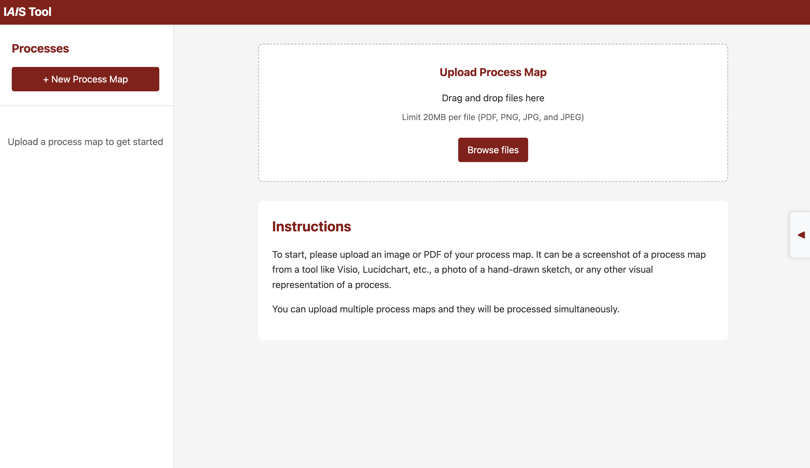
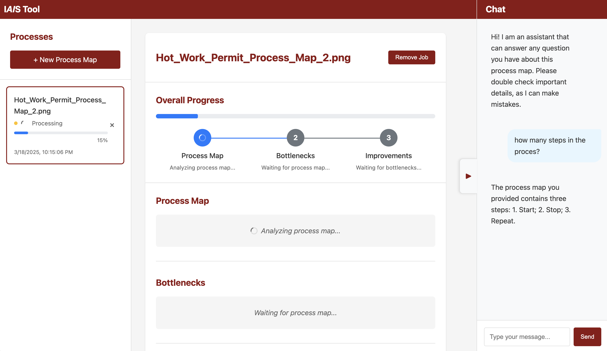
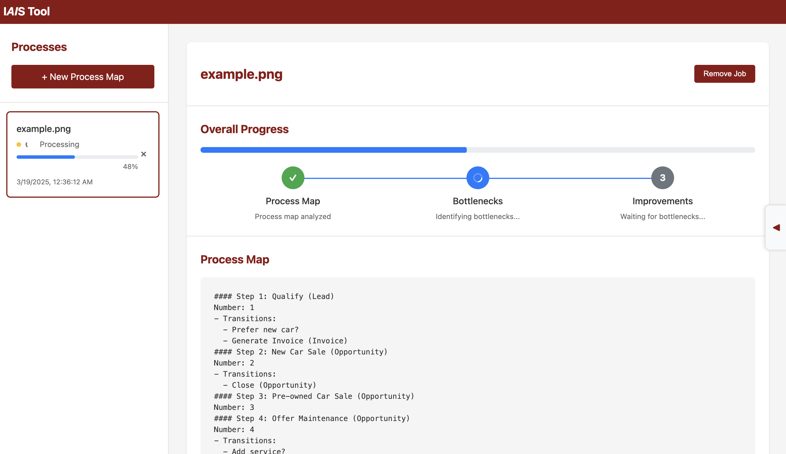
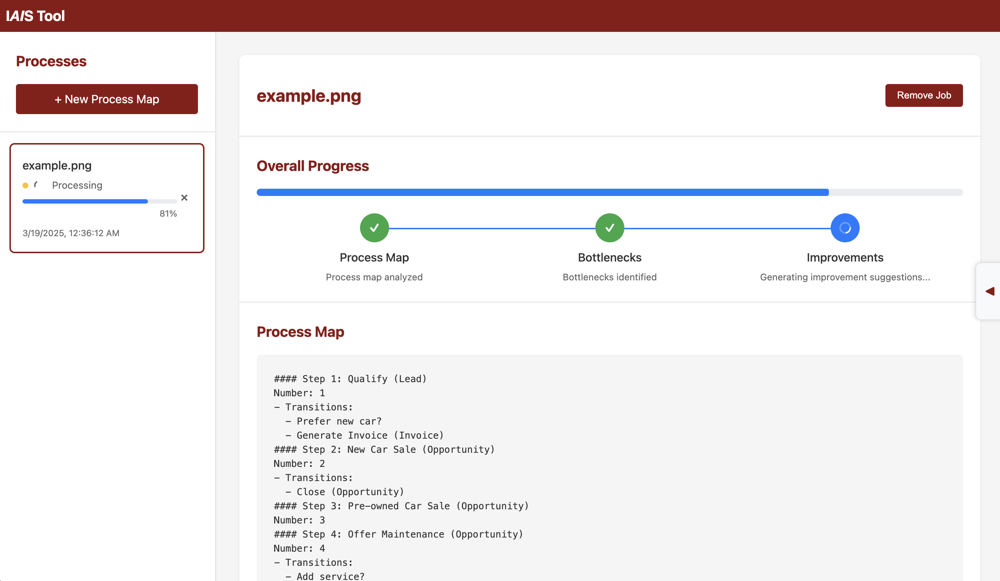
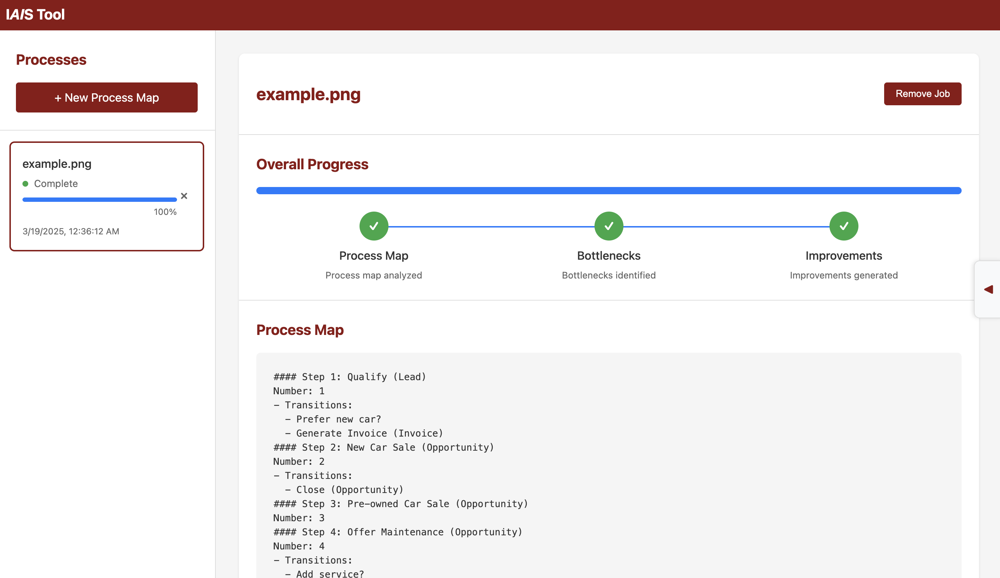
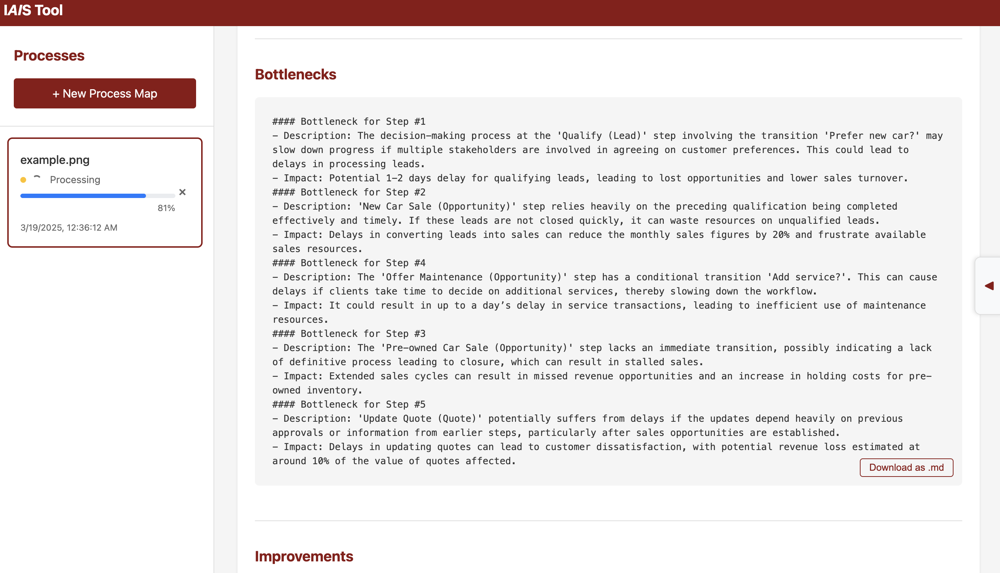
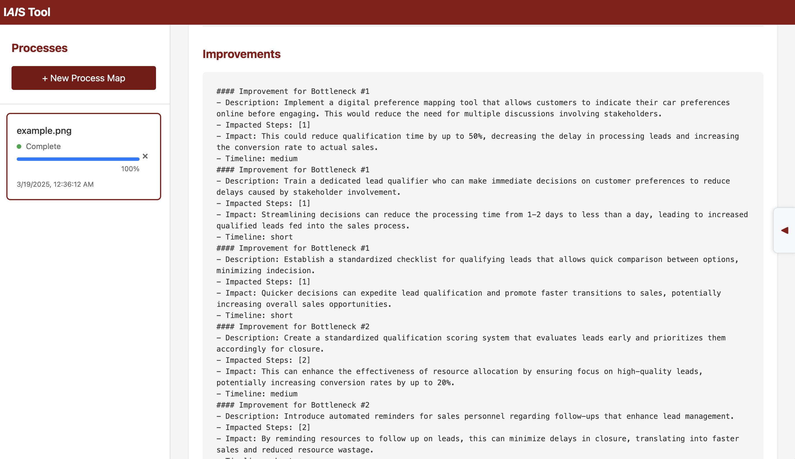
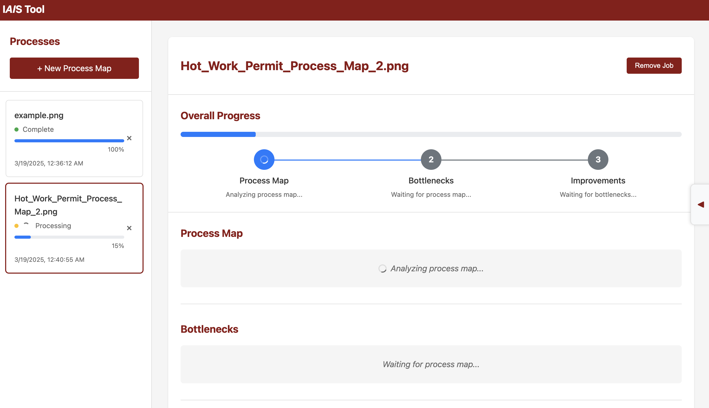
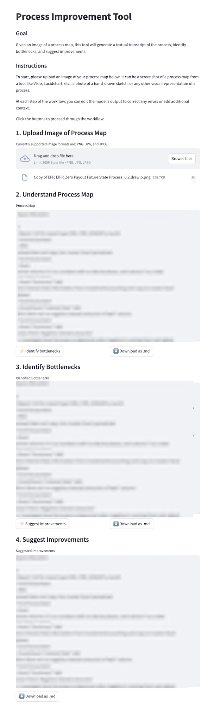

#### The below is shown how to use the whole application end-to-end if you wish to try it out yourself. I wrote my code in procopt/server folder. More specifically I wrote app.py, llm_utils.py, utils.py, models.py and pipeline.py files so those are the ones part of review.

# Process Optimization Tool

Flask + React app for helping with process optimization projects using VLMs.

## Installation
```bash
conda create -n procopt python=3.10 -y
conda activate procopt
pip install -e .
```

## Usage
```bash
export OPENAI_API_KEY=<your_openai_api_key>

# Flask app (Terminal 1)
python procopt/server/app.py

# React app (Terminal 2)
cd procopt/client/ && npm start
```

## Screenshots

















## Archive

Old initial version of the tool (blurred for privacy).


